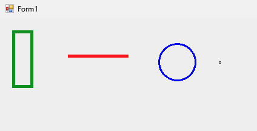

# Statistic's Homework 
Hi! I'm Andrea Maggiore (**ID**: 1947898), and this is my personal blog where I will publish my statistic's homework and other things. 

<details>
<summary>HomeWork 1</summary>
<div class = "markdown">

#### **What's statistics?**
Statistics is a **branch of mathematics** and a field of study that involves collecting, analyzing, interpreting, presenting, and organizing data.
Its primary purpose is to extract meaningful information and insights from data, which can be used for making informed decisions, drawing conclusions, and understanding patterns or trends in various phenomena.
The statistics contains:  
1. **Data Collection**: Gathering relevant data through surveys, experiments, observations, or other methods.  
2. **Data Analysis**: Examining and summarizing data using various statistical techniques, such as descriptive statistics 
(mean, median, mode, standard deviation), inferential statistics (hypothesis testing, confidence intervals), and data visualization (graphs, charts, histograms).  
3. **Data Interpretation**: Drawing conclusions and making inferences based on the analysis of data, including identifying patterns, correlations, and trends.  
4. **Probability**: Assessing the likelihood of events occurring and using probability theory to make predictions and decisions.  
5. **Sampling**: Selecting a subset of data (a sample) from a larger population to make inferences about the entire population.  
6. **Experimental Design**: Planning and conducting experiments to investigate relationships and causal effects between variables.  

Statistics plays a crucial role in a wide range of fields, including science, business, social sciences, economics, medicine, engineering, and more. 
It helps researchers, analysts, and decision-makers make sense of data and make informed choices based on evidence rather than intuition or guesswork. 
Statistical methods are also used to test hypotheses, estimate parameters, and quantify uncertainty in various contexts.

#### **What's the difference between a Descriptive and Inferential Statistics?**
Descriptive statistics and inferential statistics are two branches of statistics used to analyze and summarize data, but they serve different purposes and have distinct characteristics:
- **Descriptive statistics** is used to describe or summarize a collection of data in a way that makes it more meaningful and useful.
- **Inferential statistics** is used to draw inferences or conclusions about a population based on a sample of data taken from the population in question.

#### **Desribe the concept of population, sample attribute, level of measurement and Dataset.**
1. **Population**: The population refers to the entire group that is the subject of a study or research. 
It includes all individuals, items, or data points that meet specific criteria or characteristics of interest.
For example, if you're studying the average income of all households in a country, the population would be all the households in that country.  
2. **Sample**: A sample is a subset of the population. Researchers often work with samples because it's often impractical or too expensive to study an entire population.
The sample should ideally be representative of the population, meaning it should accurately reflect the characteristics and diversity of the larger group.
Using the example above, if you can't study all households in a country, you might select a random sample of households to estimate the average income.
3. **Attribute**: An attribute is a characteristic or feature of an object or individual within a dataset. In statistical terms, attributes are often referred to as variables.
For example, in a dataset about people, attributes could include age, gender, income, education level, etc.
4. **Variable**: Variables are the specific measures or characteristics that can be observed and recorded. They can take on different values for different data points in a dataset.
Variables can be categorized into different types based on their level of measurement (see the next point).
5. **Level of measurement**: The level of measurement refers to the mathematical nature of a variable or the way it's measured.
There are four levels of measurement: **nominal**, **ordinal**, **interval**, and **ratio**.
6. **Dataset**: A dataset is a collection of data points or observations. It can be represented in the form of a table or matrix, where each row represents a data point and each column represents a variable.

#### **Briefly describe the main sampling methods**
There are several main sampling methods used in research and statistics, each with its own advantages and disadvantages. Here's a brief description of some of the primary sampling methods:
1. **Simple Random Sampling**: Simple random sampling is a sampling method where each data point in a population has an equal chance of being selected.
2. **Stratified Sampling**: Stratified sampling is a sampling method where the population is divided into subgroups or strata based on a specific characteristic or attribute.
Then, a random sample is taken from each subgroup.
3. **Cluster Sampling**: Cluster sampling is a sampling method where the population is divided into clusters or groups based on a specific characteristic or attribute.
Then, a random sample of clusters is selected, and data is collected from all members of each selected cluster.
4. **Systematic Sampling**: Systematic sampling is a sampling method where the population is ordered in some way, and a starting point is selected at random.
Then, every nth data point is selected from the population to be included in the sample.
5. **Convenience Sampling**: Convenience sampling is a sampling method where data is collected from the most readily available sources.
6. **Quota Sampling**: Quota sampling is a sampling method where the population is divided into subgroups or strata based on a specific characteristic or attribute.
Then, a non-random sample is taken from each subgroup based on a pre-defined quota.
7. **Snowball Sampling**: Snowball sampling is a sampling method where existing study subjects recruit future subjects from among their acquaintances.
8. **Judgment Sampling**: Judgment sampling is a sampling method where the researcher uses their judgment to select study subjects that are most representative of the population.

Each of these sampling methods has its own strengths and weaknesses, and the choice of method depends on the research objectives, available resources, and the nature of the population being studied. The goal is to select a sample that is both practical and representative to draw valid conclusions.

#### **Briefly describe the main experiment designs**
Experimental designs are structured approaches to conducting scientific experiments to investigate the effects of one or more independent variables on a dependent variable. There are several main types of experimental designs, each with its own characteristics and applications. Here's a brief description of the primary experimental designs:

1. **Completely Randomized Design**: In a completely randomized design, study subjects are randomly assigned to different treatment groups.
2. **Randomized Block Design**: In a randomized block design, study subjects are first divided into blocks based on a specific characteristic or attribute.
Then, subjects within each block are randomly assigned to different treatment groups.
3. **Factorial Design**: In a factorial design, study subjects are randomly assigned to different treatment groups, and each subject is exposed to multiple treatments.
4. **Split-Plot Design**: In a split-plot design, study subjects are first divided into blocks based on a specific characteristic or attribute.
Then, each block is divided into subplots, and subjects within each subplot are randomly assigned to different treatment groups.
5. **Repeated Measures Design**: In a repeated measures design, each subject is exposed to multiple treatments, and the order of treatments is randomized.
6. **Response Surface Design**: In a response surface design, study subjects are randomly assigned to different treatment groups, and each subject is exposed to multiple treatments.
However, the order of treatments is not randomized, and the treatments are applied in a specific sequence.
7. **Latin Square Design**: In a Latin square design, study subjects are first divided into blocks based on a specific characteristic or attribute.
Then, each block is divided into subplots, and subjects within each subplot are randomly assigned to different treatment groups.


## JavaScipt code for the homework
In this section I will show you the code I used to solve the homework.

**Link to HTML's page**: [Link](Homework1/Homework.html)

Code:  
```
<!DOCTYPE html>
<html>
    <head>
    <title>Disegna le figure</title>
    <h1>
        Homework in JavaScript
    </h1>
</head>
<body>
<canvas id = "myCanvas" width = "2000" height = "2000"><\canvas>

<script>
    var canvas = document.getElementById("myCanvas");
    var circle = canvas.getContext("2d");
    var line = canvas.getContext("2d");
    var rect = canvas.getContext("2d");
    var point = canvas.getContext("2d");

    //Inizializzo Cerchio
    circle.beginPath();
    circle.arc(100, 100, 50, 0, 2 * Math.PI);
    circle.fillStyle = "red";
    circle.fill();
    circle.strokeStyle = "black";
    circle.lineWidth = 5;
    circle.stroke();
    circle.closePath();

    //Inizializzo line
    line.strokeStyle = "black";
    line.lineWidth = 2;
    line.beginPath();
    line.moveTo(300,50);
    line.lineTo(175,200);
    line.stroke();

    //Inizializzo Rettangolo
    rect.strokeStyle = "blue";
    rect.fillStyle = "red";
    rect.lineWidth = 6;
    rect.fillRect(50,300,90,50);
    rect.strokeRect(50,300,90,50);

    //Inizializzo Punto
    point.beginPath();
    point.arc(250, 325, 5, 0, 2 * Math.PI);
    point.fillStyle = "green";
    point.fill();
    point.strokeStyle = "green";
    point.lineWidth = 1;
    point.stroke();
    point.closePath();


</script>
</body>
</html>
```  

**In C#**:  

  

```
using System;
using System.Drawing;
using System.Windows.Forms;

namespace HomeWork1
{
    public partial class Form1 : Form
    {
        public Form1()
        {
            InitializeComponent();
        }

        private void panel1_Paint_1(object sender, PaintEventArgs e)
        {
            Pen rect = new Pen(Color.FromArgb(255, 0, 155, 0), 5);
            Pen line = new Pen(Color.Red, 5);
            Pen circle = new Pen(Color.Blue, 3);
            Pen point = new Pen(Color.Black, 3);

            e.Graphics.DrawRectangle(rect, 10, 10, 30, 90);
            e.Graphics.DrawLine(line, 100, 50, 200, 50);
            e.Graphics.DrawEllipse(circle, 250, 30, 60, 60);
            e.Graphics.DrawEllipse(point, 350, 60, 1, 1);
        }
    }
}

```
/div>
</details>

